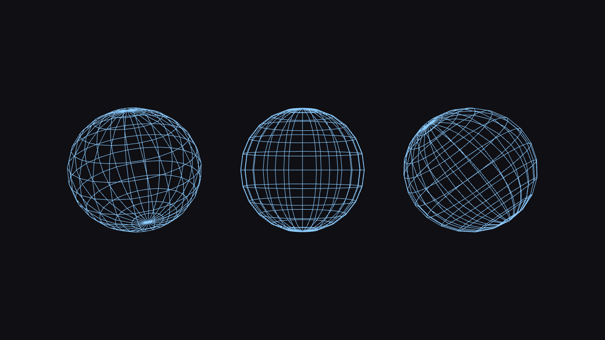
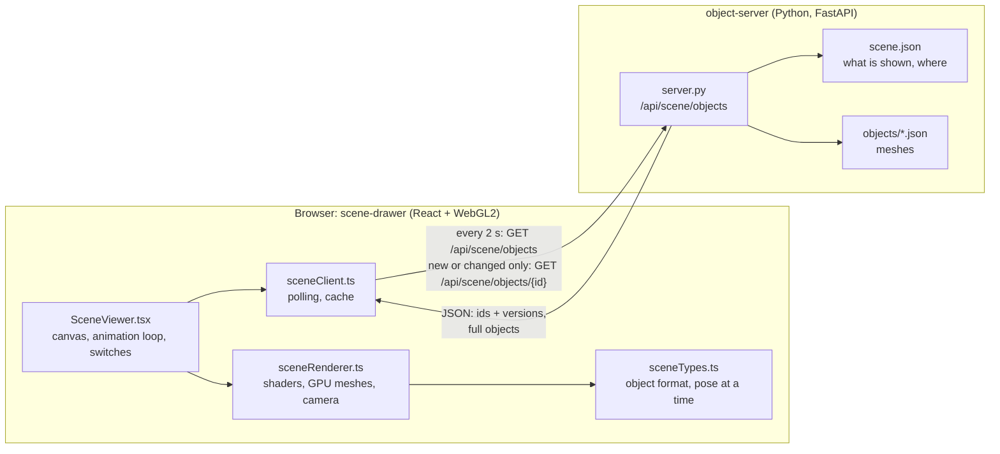

# Scene Drawer



**Scene Drawer draws a 3D scene in the browser whose objects come from a server.** The browser knows how to draw; the server decides *what* is drawn and *where*. Add an object file on the server, and every open page shows it within two seconds, without a reload.

The scene in the browser is a WebGL2 renderer in React. The **object server** is a small Python (FastAPI) service that hands out objects: their mesh (the corners and how they're connected), their placement (position, rotation, size), and how they move.

## Features

- **Objects from the server:** meshes of triangles (surfaces, lit) or lines (wireframes and outlines, no surface).
- **One shader for everything:** every object is drawn by the same WebGL program; only its model matrix changes.
- **Live updates by polling:** the page asks the server every 2 seconds what the scene contains, and fetches only objects that are new or have changed.
- **Cached in the browser:** an object is downloaded and uploaded to the GPU once per version.
- **Scenes separate from objects:** `scene.json` decides which objects appear and where. One object can appear many times, each with its own placement.
- **Two kinds of perspective:** one camera for the whole scene, or a perspective of its own for each object (a switch at the bottom of the page).
- **Validated on the server:** a broken object file is skipped with a warning, so the page never receives it.
- **Ready for animation:** every object carries a `motion`. Only `static` exists so far, but the renderer already asks every object for its pose at the current time, every frame.

## Architecture



### Who does what

| | Object server | Browser (renderer) |
|---|---|---|
| **Knows** | which objects exist, what they look like, where they are, how they move | how to draw an object, the camera, the lighting |
| **Decides** | the content of the scene | how the scene looks on this screen |
| **Stores** | object files and the scene (on disk) | fetched objects (in memory) and their meshes (on the GPU) |
| **Computes** | validation, versions, placement | matrices, projection, lighting, every pixel |

The split is deliberate. **The server describes the world; the browser draws it.** The server never sends pictures, shaders or camera settings, only data: corners, colours, connections and placements. That keeps the server simple and the traffic small, and it lets one server feed many different renderers. A future renderer (another camera, VR, a different engine) only has to read the same format.

### How the two sides stay in sync

The browser **polls**: it asks, the server answers. The server never contacts the browser by itself.

1. **The list, every 2 seconds.** `GET /api/scene/objects` returns only ids and versions:
   ```json
   {"objects": [{"id": "cube", "version": "016fb3ebcb149a11"}, {"id": "sphere", "version": "0104e7da8f4ff114"}]}
   ```
   This is small and cheap, so it can be asked often.
2. **Objects, only when needed.** The browser compares the list with its cache:
   - **new id, or a different version:** `GET /api/scene/objects/{id}` fetches the full object;
   - **same version:** nothing is fetched; the cached object is used;
   - **no longer listed:** the object is removed from the scene, and its GPU memory is freed.
3. **The version** is a hash of the object file, together with its placement in `scene.json`. It changes exactly when what the browser would draw changes, and never otherwise.
4. **If the server is unreachable,** the page keeps drawing what it has, shows "server unreachable", and tries again 2 seconds later. When the server is back, it catches up by itself.

The next poll only starts after the previous one has finished, so a slow server never gets a pile of requests.

### Where the work happens in the browser

- **[sceneClient.ts](scene-drawer/src/scene/sceneClient.ts):** the polling loop and the cache, a `Map` from id to object. The cache lives as long as the page; a reload starts empty.
- **[sceneRenderer.ts](scene-drawer/src/scene/sceneRenderer.ts):** each object's mesh is uploaded to the GPU once, as a vertex array object (VAO) per object and version. Every frame, each object gets its model matrix (from its transform and motion) and is drawn with the same shader program:
  - **vertex shader:** mesh coordinates → world (`u_model`) → screen (`u_viewProjection`);
  - **fragment shader:** the vertex colour, blended across each triangle by the GPU. Triangles are lit by one light; the surface direction is worked out per pixel from the screen-space change of the world position, so meshes don't need normals. Lines are drawn unlit, in their exact colour.
- **[sceneTypes.ts](scene-drawer/src/scene/sceneTypes.ts):** the object format in TypeScript, and `poseAt(object, time)`, the one place where motion turns into a model matrix.
- **[SceneViewer.tsx](scene-drawer/src/scene/SceneViewer.tsx):** the React component. React renders the canvas once; drawing (every frame) and polling run outside React, so they never cause re-renders.

### Perspective: shared or per object

The camera is at (0, 0, 8) and looks at (0, 0, 0), with a 45° field of view. A switch at the bottom of the page chooses how it sees the objects:

- **One camera for all objects** (the default): a normal 3D view. Objects away from the middle are seen at an angle, and lines into the depth converge toward the middle of the screen.
- **Own perspective per object:** each object looks as if the camera stood straight in front of it. For every object, the camera slides sideways (without turning) until the object's centre is straight ahead, and the picture is then moved to where the object's centre is with the shared camera. Identical objects look identical wherever they are. The depth doesn't change, so nearer objects still hide farther ones.

## The object format

An object file in `object-server/objects/` (the file name is the object's name):

```json
{
  "description": "A rectangle outline: 4 corners joined by 4 lines.",
  "mesh": {
    "primitive": "lines",
    "positions": [-0.6, -0.4, 0,   0.6, -0.4, 0,   0.6, 0.4, 0,   -0.6, 0.4, 0],
    "colors":    [0.95, 0.95, 0.95,   0.95, 0.95, 0.95,   0.95, 0.95, 0.95,   0.95, 0.95, 0.95],
    "indices":   [0, 1,   1, 2,   2, 3,   3, 0]
  },
  "transform": {"translation": [0, 0, 0], "rotation": [0, 0, 0], "scale": [1, 1, 1]},
  "motion": {"type": "static"}
}
```

| Field | Meaning | Default |
|---|---|---|
| `mesh.primitive` | `"triangles"` (a surface, lit) or `"lines"` (no surface, unlit) | `"triangles"` |
| `mesh.positions` | x, y, z for every corner (vertex) | required |
| `mesh.colors` | r, g, b (0 to 1) for every vertex; blended across triangles and along lines | light grey |
| `mesh.indices` | which vertices are connected: three per triangle, two per line | vertices in order |
| `transform.translation` | where the object stands | `[0, 0, 0]` |
| `transform.rotation` | degrees around x, y and z | `[0, 0, 0]` |
| `transform.scale` | size along x, y and z | `[1, 1, 1]` |
| `motion` | how the object moves; only `{"type": "static"}` so far | static |
| `description` | free text for people | empty |

The object is scaled, then rotated, then moved. Centre a mesh on (0, 0, 0), so that it rotates around its own centre.

A vertex has exactly one colour. A face with its own plain colour therefore needs its own vertices: the example cube has 24 vertices (4 per face), not 8. Vertices shared between faces give smooth gradients across the edges instead.

The examples in [object-server/objects/](object-server/objects/) are a cube, a pyramid, a triangle, a rectangle outline and a wireframe sphere. The sphere is generated by [tools/make_sphere.py](object-server/tools/make_sphere.py), with adjustable rings, meridians and colour.

The authoritative definition is the Pydantic models in [server.py](object-server/server.py). While the server runs, it also describes the format and both endpoints at **http://localhost:8091/docs**.

## The scene: `scene.json`

[object-server/scene.json](object-server/scene.json) decides what the scene contains:

```json
{
  "objects": [
    "triangle",
    {"id": "rectangle-left",  "object": "rectangle", "transform": {"translation": [-2, 0, 0]}},
    {"id": "rectangle-right", "object": "rectangle", "transform": {"translation": [2, 0, 0], "rotation": [0, 30, 0]}}
  ]
}
```

- **A name** shows that object once, as its file describes it.
- **An instance** (`id`, `object`, `transform`) places an object with its own id. Its `transform` replaces only the parts it lists; the rest comes from the object file. One object can appear any number of times, as long as every id is unique.
- **Without `scene.json`,** every object file is shown once.

Other scenes can live in their own files; `SCENE_FILE` chooses which one the server uses. The picture at the top of this page is [scenes/three-spheres.json](object-server/scenes/three-spheres.json): one sphere object, placed three times with different rotations.

```bash
cd object-server && SCENE_FILE=scenes/three-spheres.json .venv/bin/uvicorn server:app --port 8091
```

The server re-reads `scene.json` and the object files when they change. Edit them while everything runs; the page follows within two seconds.

## Running it locally

**Requirements:** Node.js 22 or newer (developed with 24), Python 3.10 or newer (developed with 3.12), and a browser with WebGL2.

### 1. Install

```bash
cd scene-drawer && npm install
cd object-server && python3 -m venv .venv && .venv/bin/pip install -r requirements.txt
```

### 2. Start the object server (terminal 1)

```bash
cd object-server && .venv/bin/uvicorn server:app --port 8091
```

### 3. Start the renderer (terminal 2)

```bash
cd scene-drawer && npm run dev
```

Open **http://localhost:5173**. In development, the page calls `/api/scene/...` on its own address, and Vite forwards those requests to the object server on port 8091 ([vite.config.ts](scene-drawer/vite.config.ts)).

### 4. Try it

1. The bottom line says **"online · 5 objects"**, and you see a cube, a pyramid, a triangle, a sphere and a rectangle.
2. **Edit `object-server/scene.json` while it runs:** remove an object, or move one. The page follows within two seconds.
3. **Add an object:** copy an object file under a new name, change its colours, and list it in `scene.json`.
4. **Click the perspective switch** at the bottom, and compare the two kinds of perspective.
5. **Stop the object server:** the page says "server unreachable" and keeps drawing. Start it again, and the page catches up.

`npm run build` type-checks the renderer (`tsc -b`) before building, and `npm run lint` runs the linter. There are no automated tests yet.

## Configuration

**Object server** (environment variables):

| Variable | Default | Meaning |
|---|---|---|
| `ALLOWED_ORIGINS` | `http://localhost:5173` | comma-separated origins whose pages may call the server (CORS), e.g. `https://example.com` |
| `SCENE_OBJECTS_DIR` | `objects/` next to `server.py` | where the object files are |
| `SCENE_FILE` | `scene.json` next to `server.py` | the scene; without it, every object is shown |

**Renderer** (build time): `VITE_OBJECT_SERVER_URL` in `scene-drawer/.env.production`, the object server's public address, e.g. `https://objects.example.com`. Leave it unset in development: the page then uses its own address, and Vite's proxy forwards the requests.

## Deployment

The renderer is a static site; the object server is a small Python service behind a reverse proxy, for example `example.com` for the page and `objects.example.com` for the server.

### Object server

1. Copy `object-server/` to the server (without `.venv` and `__pycache__`), create the environment there and install `requirements.txt`.
2. Run it permanently, only reachable from the server itself, e.g. with a systemd unit:

   ```ini
   [Unit]
   Description=Scene Drawer object server
   After=network.target

   [Service]
   User=scenedrawer
   WorkingDirectory=/home/scenedrawer/object-server
   Environment=ALLOWED_ORIGINS=https://example.com
   ExecStart=/home/scenedrawer/object-server/.venv/bin/uvicorn server:app --host 127.0.0.1 --port 8091
   Restart=always

   [Install]
   WantedBy=multi-user.target
   ```

3. Put a reverse proxy with HTTPS in front of it, e.g. nginx with `proxy_pass http://127.0.0.1:8091;`.
4. Check: `curl https://objects.example.com/api/scene/objects` answers with the list of objects.

### Renderer

1. Set the object server's address and build:

   ```bash
   cd scene-drawer && echo "VITE_OBJECT_SERVER_URL=https://objects.example.com" > .env.production && npm run build
   ```

2. Upload `scene-drawer/dist/` to the web server's document root. `index.html` should not be cached; the hashed files in `assets/` can be cached forever.

## Repository layout

```
scene-drawer/                     the renderer (React, Vite, TypeScript, WebGL2)
├── vite.config.ts                dev proxy: /api/scene -> object server on :8091
└── src/
    ├── main.tsx                  mounts the scene full screen
    └── scene/
        ├── SceneViewer.tsx       the component: canvas, animation loop, status, perspective switch
        ├── sceneClient.ts        polling and cache
        ├── sceneRenderer.ts      WebGL2: one shader program, GPU meshes, camera, perspective modes
        └── sceneTypes.ts         the object format, poseAt (motion -> model matrix)
object-server/                    the object server (Python, FastAPI)
├── server.py                     the API, the object format (Pydantic), validation, versions
├── scene.json                    what the scene shows, and where (the default scene)
├── scenes/                       other scenes, chosen with SCENE_FILE
├── objects/                      one JSON file per object
├── tools/make_sphere.py          generates wireframe spheres
└── requirements.txt
docs/screenshot.png               the picture at the top of this README
```

## Roadmap

- **Animation.** New motion types, e.g. `{"type": "spin", "axis": [0, 1, 0], "degreesPerSecond": 45}`: a model on the server and a case in `poseAt`. The renderer already draws every frame and passes the time. A renderer that doesn't know a motion type yet shows the object standing still.
- **Shared meshes.** Today every instance carries its own copy of the mesh. Sending a mesh once, and only the placement per instance, would make many copies of large meshes cheap ("one mesh, many model matrices").
- **Push instead of poll.** Server-sent events or a WebSocket would deliver changes immediately and save the polls when nothing changes. The list-plus-versions protocol would stay the same.
- **Thick lines and hidden back lines.** WebGL draws lines one pixel wide. Thicker lines need strips of triangles that face the camera. Wireframes could also hide the lines on their back, behind an invisible depth-only surface.
- **Camera control.** Turning and zooming the view with mouse and touch.
- **Generated types.** The TypeScript types are written by hand next to the Pydantic models; generating them from the server's OpenAPI schema would keep the two from drifting apart.
